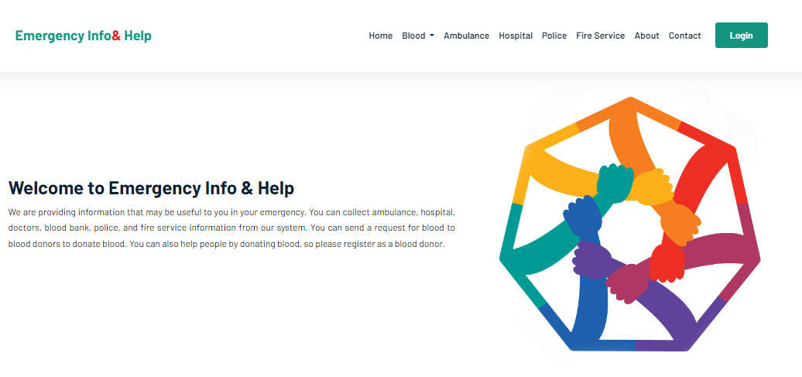
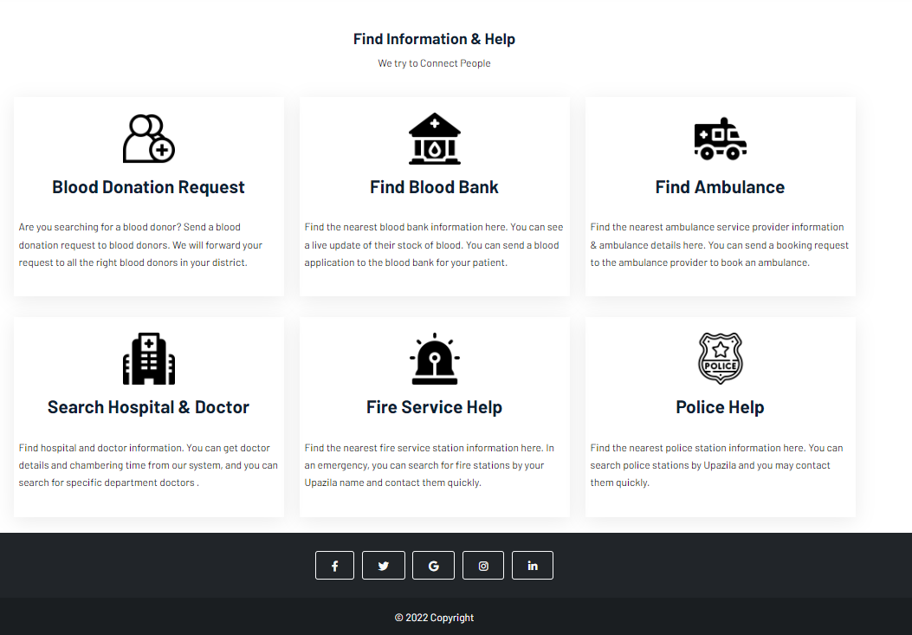

<h1>Emergency Information Providing System</h1>

The ''emergency information providing system'' is to provide emergency information such as blood, ambulance, hospital, police, and fire service. The objective of our project is to help the people of Bangladesh by providing emergency information. We want people to be able to get emergency information easily. As a result, they can communicate quickly with emergency service providers. 

Languages & framework : HTML, CSS, JAVAScript, bootstrap 5, PHP 

Screen Shot </>

Home Page: 

 

